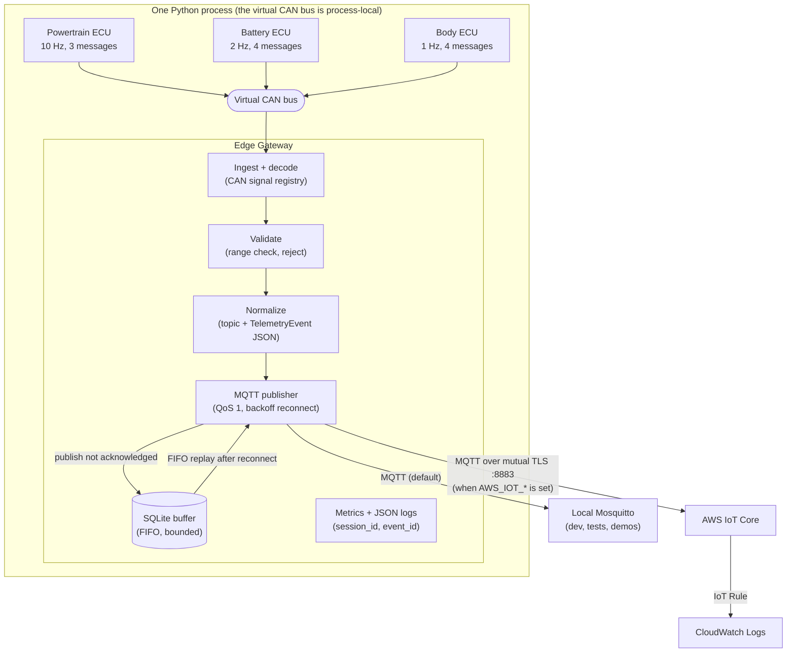
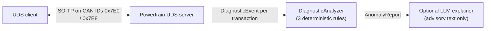
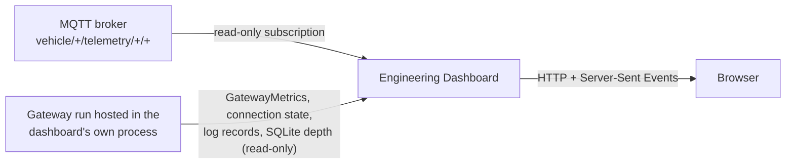

# Edge-to-Cloud Automotive Telemetry POC

[](https://github.com/shravaniishinde/edge-to-cloud-automotive-telemetry-poc/actions/workflows/ci.yml)

A no-hardware automotive telemetry proof of concept:
**virtual ECUs → CAN → Edge Gateway → resilient MQTT → AWS IoT Core → observability and an engineering dashboard.**

Everything runs on a laptop: three simulated ECUs on a virtual CAN bus,
an edge gateway that keeps working through connectivity loss, a local
Mosquitto broker for repeatable demos, and a real AWS IoT Core path
(Terraform-provisioned, mutual TLS) for the cloud side.

> **What this is not:** not connected to a real vehicle or CAN hardware,
> not certified automotive software (e.g. ISO 26262), and not a production
> deployment. It is a portfolio engineering POC that applies real-world
> edge-to-cloud concerns at small scale.

## Why this project

Vehicles produce continuous telemetry, but the link to the cloud is
unreliable. An edge-to-cloud pipeline has to decode and validate raw bus
data, keep collecting when the network drops, buffer locally without
losing order, reconnect without hammering the broker, replay what it
missed, and stay observable while doing all of it. Diagnostics (UDS) and
anomaly detection sit alongside the telemetry path. This project builds
each of those pieces small enough to read in an afternoon, and tests them
end to end.

## Key capabilities

| Area | What is implemented |
|---|---|
| Vehicle simulation | 3 logical ECUs (powertrain 10 Hz, battery 2 Hz, body 1 Hz), 11 CAN messages, seeded random-walk values — [`simulation/`](simulation/), [CAN signal spec](docs/can-signal-spec.md) |
| Virtual CAN | `python-can` virtual bus: no kernel modules, identical on Windows, Linux, Docker, and CI |
| CAN decoding | one signal registry (IDs, byte layout, scale, units, valid ranges) shared by the simulator and gateway — [`common/can_signal_map.py`](common/can_signal_map.py) |
| UDS diagnostics | ISO-TP transport; `DiagnosticSessionControl`, `ReadDataByIdentifier`, `ReadDTCInformation` on the powertrain ECU — [UDS spec](docs/uds-spec.md) |
| Edge Gateway | ingest → decode → validate (reject out-of-range) → normalize → publish — [gateway spec](docs/edge-gateway-spec.md) |
| Resilience | SQLite buffer (persistent, bounded), exponential-backoff reconnect (1 s → 30 s cap), strict FIFO replay, at-least-once delivery |
| MQTT | QoS 1, topic `vehicle/{vehicle_id}/telemetry/{ecu}/{signal}`, `TelemetryEvent` JSON payload |
| Cloud | AWS IoT Core over mutual TLS, IoT Rule → CloudWatch Logs, all provisioned with Terraform — [AWS setup](docs/aws-setup.md) |
| Diagnostic analysis | 3 deterministic anomaly rules; optional LLM explanation that is advisory only — [analyzer spec](docs/analyzer-spec.md) |
| Observability | structured JSON logs, `session_id` per gateway run, `event_id` per event, `GatewayMetrics` counters |
| Fault injection | named, deterministic scenarios (publish failures, connection outage, malformed/out-of-range frames) |
| Resilience demo | self-verifying outage → buffering → reconnect → FIFO replay scenario with PASS/FAIL |
| Engineering dashboard | read-only live view: status, metrics, resilience lifecycle, charts, events, diagnostics, activity |
| Quality | pytest unit, broker-backed integration, and full-scenario tests; Docker/Compose; GitHub Actions CI |

## Architecture



Diagnostics run beside the telemetry path, over the same virtual bus:



The dashboard is a separate read-only layer. It is not a stage in the
telemetry path:



Two identifiers tie it together: **`session_id`** identifies one gateway
run and **`event_id`** identifies one telemetry event. Both travel in
every payload and on the gateway's log lines. Full detail, diagrams, and
the decision log are in [ARCHITECTURE.md](ARCHITECTURE.md).

## Quick start (Windows PowerShell)

Prerequisites: Python 3.11 (via the `py` launcher), Docker Desktop, Git.
Commands use the virtual environment's interpreter directly, so no
activation is needed.

```powershell
git clone https://github.com/shravaniishinde/edge-to-cloud-automotive-telemetry-poc.git
cd edge-to-cloud-automotive-telemetry-poc
py -3.11 -m venv .venv
.\.venv\Scripts\python.exe -m pip install -r requirements.txt
```

Start the local MQTT broker, then the dashboard:

```powershell
docker compose -f docker/docker-compose.yml up -d mosquitto
```

```powershell
.\.venv\Scripts\python.exe -m dashboard.backend
```

Open http://127.0.0.1:8080 and click **Start live demo**. In a second
terminal you can also run the gateway on its own, or the scripted
resilience check:

```powershell
.\.venv\Scripts\python.exe run_demo.py --duration 60
```

```powershell
.\.venv\Scripts\python.exe -m scenarios.resilience_demo
```

To watch raw MQTT traffic (Windows has no native `mosquitto_sub`; this
runs the one inside the broker container):

```powershell
docker compose -f docker/docker-compose.yml exec mosquitto mosquitto_sub -t "vehicle/#" -v
```

On Linux/macOS, use `python3.11 -m venv .venv` and `.venv/bin/python`
instead. A fully containerized run needs no local Python:
`docker compose -f docker/docker-compose.yml up --build` starts the broker
plus the `run_demo.py` app, and
`docker compose -f docker/docker-compose.yml --profile dashboard up --build`
also starts the dashboard on http://127.0.0.1:8080.

## Engineering dashboard

`python -m dashboard.backend` serves a single page (standard-library HTTP
server, plain HTML/CSS/JS, no CDN) that updates once a second. It shows:

- **System status:** gateway run and `session_id`, gateway MQTT
  connection, telemetry flow, vehicles and sessions seen, and the
  dashboard's own broker subscription.
- **Gateway metrics:** processed, rejected, publish failures, buffered,
  replayed, dropped. These are cumulative counters, shown separately
  from the *current* SQLite buffer depth.
- **Resilience lifecycle:** NORMAL → OUTAGE → BUFFERING → RECONNECTING →
  REPLAYING → RECOVERED, derived only from observable facts.
- **Live telemetry:** charts for speed, RPM, state of charge and pack
  current, plus the latest value of all 11 signals.
- **Vehicles / ECUs, event stream** (with `event_id`, `session_id`, topic,
  and live / replayed / late status), **diagnostics**, and an **activity**
  feed of the gateway's own log lines.

**Demo controls** are a fixed list of actions that start existing
components: start/stop a live demo, inject/clear a simulated MQTT outage,
run the scripted resilience check, and run a UDS diagnostic session. The
dashboard never publishes telemetry, buffers, or replays.

No screenshots are committed; the [demo guide](docs/demo-guide.md) walks
through what to show.

## Resilience demo

The core behaviour this project demonstrates is what happens when the
broker becomes unreachable. In the dashboard, click **Inject MQTT
outage**, wait, then **Clear outage**, and watch the lifecycle move:

| Stage | What is happening |
|---|---|
| NORMAL | Telemetry publishes and the broker acknowledges each event (QoS 1). |
| OUTAGE | The publisher is disconnected; nothing buffered yet. |
| BUFFERING | ECUs keep sending and the gateway keeps validating. Every event that can't be published goes into the local SQLite buffer. Reconnect attempts back off 1 s, 2 s, 4 s … (capped at 30 s). |
| RECONNECTING | The outage is over; the gateway notices on its next backoff-timed attempt. |
| REPLAYING | The buffer is drained oldest-first, before any new live event, keeping each event's original `event_id` and `session_id`. |
| RECOVERED | The buffer is empty; buffered = replayed; live telemetry continues. |

`python -m scenarios.resilience_demo` runs the same story as a
self-checking script. It verifies with a real MQTT subscriber that every
buffered `event_id` arrives, in FIFO order, with its identity intact, then
prints PASS/FAIL with the actual counts and exits non-zero on failure.

Delivery is **at-least-once**, not exactly-once: a buffered row is deleted
only after the broker acknowledges it, so an event can arrive more than
once but is not lost while it is in the buffer. See
[Known limitations](#known-limitations).

## AWS IoT Core

Local Mosquitto is the default for everything, including CI. The same
gateway code can publish to AWS IoT Core instead:

- **Provisioning:** Terraform in [`infra/`](infra/) creates the IoT
  Thing, an X.509 device certificate, a least-privilege IoT policy
  (connect only as the Thing's client ID, publish only to `vehicle/*`),
  an IoT Rule `SELECT * FROM 'vehicle/+/telemetry/+/+'`, and a CloudWatch
  Logs group (region `ap-south-1` by default).
- **Transport:** MQTT over mutual TLS on port 8883, using the same
  `MqttPublisher` with optional TLS arguments. No AWS SDK is needed at
  runtime.
- **Selection:** set `AWS_IOT_ENDPOINT`, `AWS_IOT_CA_PATH`,
  `AWS_IOT_CERT_PATH`, `AWS_IOT_KEY_PATH`, and
  `AWS_IOT_CLIENT_ID=edge-to-cloud-telemetry-poc-vehicle` (the policy
  requires it). A partial configuration is an error, never a silent
  fallback to Mosquitto.
- **Secrets:** certificates, private keys, `.env`, and Terraform state
  are gitignored and never committed.
- **Verification:** the existing smoke test
  (`edge_gateway/tests/test_aws_iot_integration.py`) passed against the
  provisioned endpoint, and the AWS IoT MQTT test client received its
  `{"smoke_test": true}` message.

Step-by-step setup, the smoke-test command, and teardown are in
[docs/aws-setup.md](docs/aws-setup.md).

## Testing

| Check | Latest verified result |
|---|---|
| Full pytest suite, local Mosquitto running, `MQTT_BROKER_REQUIRED=1` | 226 passed, 1 skipped (the AWS test, which needs real AWS configuration) |
| Full pytest suite, no broker (broker tests skip with a reason) | 212 passed, 15 skipped |
| AWS IoT smoke test (manual, needs real AWS configuration) | 1 passed |

The suite covers unit tests per module; broker-backed integration tests
(real Mosquitto, real subscriber); a full-scenario test (seeded ECUs →
virtual CAN → gateway → MQTT → subscriber); the resilience demo; and the
dashboard's state, HTTP API, and real-chain integration tests. No test
makes a real Anthropic API call, and the AWS test skips unless AWS is
configured.

```powershell
$env:MQTT_BROKER_REQUIRED = "1"; .\.venv\Scripts\python.exe -m pytest -v -rs
```

**CI** ([`.github/workflows/ci.yml`](.github/workflows/ci.yml)) runs on
every push and pull request to `main`. It does a syntax check with
`compileall`, installs dependencies, validates the Compose file, installs
and waits for Mosquitto, then runs the full suite with
`MQTT_BROKER_REQUIRED=1`, so broker tests fail rather than silently skip.
CI needs no AWS or Anthropic credentials.

## Project structure

```
├── simulation/          3 ECUs, virtual CAN helpers, UDS client/server (simulation/uds/)
├── common/              shared schemas: TelemetryEvent, DiagnosticEvent, CAN signal registry
├── edge_gateway/        ingest, validate, normalize, MQTT publisher, SQLite buffer,
│                        metrics, logging, fault injection, local-vs-AWS selection
├── analyzer/            deterministic anomaly rules + optional LLM explainer
├── scenarios/           resilience_demo.py (self-verifying outage/recovery)
├── dashboard/           backend/ (stdlib HTTP + SSE), frontend/ (HTML/CSS/JS), tests/
├── infra/               Terraform: IoT Thing, certificate, policy, IoT Rule, CloudWatch Logs
├── docker/              Dockerfile, docker-compose.yml, Mosquitto config
├── docs/                specifications, AWS setup, limitations, demo guide, project summary
├── run_demo.py          ECUs + gateway in one process, publishing to MQTT
└── .github/workflows/   CI
```

## Engineering decisions

| Decision | Why |
|---|---|
| `python-can` virtual bus | Needs no kernel module or privileges, so it behaves the same on Windows, Docker, and CI. The trade-off is that it only works within one process, so ECUs and gateway run as threads together. |
| SQLite for the buffer | Standard library, no extra service, transactional, and it survives a gateway restart. |
| Strict FIFO replay | Telemetry is a time series; replay stops at the first unacknowledged row rather than sending later events ahead of it. |
| At-least-once delivery | A row is deleted only after a broker acknowledgement. Exactly-once would need a transaction spanning broker and database, which this POC doesn't need to demonstrate. |
| Kinesis deferred | CloudWatch Logs via an IoT Rule proves telemetry reaches the cloud. Fan-out, if ever needed, is another IoT Rule action, with no gateway change. |
| Rules detect, LLM explains | Anomaly detection is deterministic and testable. The LLM layer can only add explanation text after the fact, and the analyzer never imports it. |
| Read-only dashboard | Visualization must not change what it observes. Metrics are shown only where they can actually be read, never estimated. |
| Local Mosquitto by default | Repeatable demos and a CI that needs no cloud account or cost. AWS is the same code with different configuration. |

## Known limitations

- The virtual CAN bus is process-local: simulator and gateway must share
  one process (and one container).
- The dashboard reads real `GatewayMetrics` only for gateway runs it
  hosts. Other gateways are visible through their MQTT telemetry only.
  History is in memory, bounded, and lost on restart.
- The dashboard has no authentication. It binds to localhost and should
  stay there.
- Diagnostics run on demand (a fixed UDS script); there is no live
  diagnostic stream. The UDS server's DTC list is static.
- The scripted outage is simulated at the publisher, not on the network.
  A real `docker compose stop mosquitto` works too, but behaves
  differently, as the next point describes.
- During a **real** broker outage, the publisher can report "connected"
  while publishes fail, and duplicate deliveries have been observed
  (about two extra copies per buffered event in one test). No data was
  lost, and this is within at-least-once semantics, but it is not yet
  root-caused.
- Kinesis, DynamoDB/S3 persistence, and production security hardening
  are intentionally out of scope.

The full, per-phase record is in
[docs/assumptions-and-limitations.md](docs/assumptions-and-limitations.md).

## Future improvements

These are ideas, not gaps in the current POC:

- Root-cause the duplicate MQTT deliveries seen during real broker outages
  (likely paho re-sending queued QoS 1 messages that the gateway also
  replays).
- A persistent observability backend, if metrics need to outlive a run.
- Authentication for the dashboard before it ever leaves localhost.
- Cloud-side streaming (for example Kinesis) if multiple consumers need
  live telemetry.

## Documentation

| Document | Contents |
|---|---|
| [ARCHITECTURE.md](ARCHITECTURE.md) | components, data flow, diagrams, full decision log, phase history |
| [docs/demo-guide.md](docs/demo-guide.md) | a 10-minute walkthrough for presenting the project |
| [docs/project-summary.md](docs/project-summary.md) | short explanations, interview Q&A, resume bullets |
| [docs/can-signal-spec.md](docs/can-signal-spec.md) | the 11 CAN messages: IDs, layout, scaling, ranges |
| [docs/uds-spec.md](docs/uds-spec.md) | UDS services, DIDs, DTCs, ISO-TP setup |
| [docs/edge-gateway-spec.md](docs/edge-gateway-spec.md) | gateway pipeline, resilience, observability, AWS publishing |
| [docs/analyzer-spec.md](docs/analyzer-spec.md) | anomaly rules, thresholds, what the LLM may and may not do |
| [docs/aws-setup.md](docs/aws-setup.md) | Terraform provisioning, environment variables, smoke test, teardown |
| [docs/assumptions-and-limitations.md](docs/assumptions-and-limitations.md) | every assumption and limitation, by phase |
